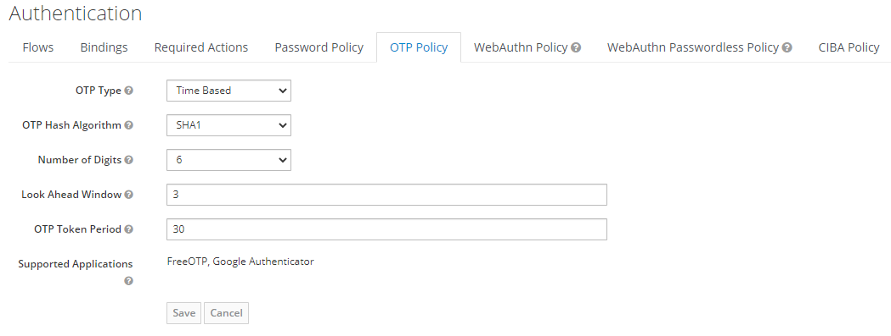

# SAK

Skeleton stack (for development purpose) built in Symfony, Angular and Keycloak, running on Docker containers using docker-compose tool.


## What's in the box ?
- Angular skeleton application following best practices
- API with symfony and Api-plateform
    - REST
    - GraphQL (switch to branch [graphql](https://github.com/el-abdel/SAK/tree/graphql))
- Identity manager (Keycloak)
- OIDC Authentication (Code Flow + PKCE)
- Two-Factor Authentication (Password + OTP)
- API Authentication/Authorization (Bearer authentication with access token using Keycloak)

## Requirement

- Docker
- NodeJs/Npm

## Installation

First, clone this repository:

```
$ git clone https://github.com/el-abdel/SAK.git
```

Next got to **sak-docker** folder.

```
$ cd sak-docker
```

Then run this command to build your environment.

```
$ docker-compose -f docker-compose/sak.yml up
```

> Do not forget to add virtual hosts (keycloak.local, sak-api.local, phpmyadmin.local) in your /etc/hosts file.

#### Configuring Symfony App

For better performance the **vendor** folder is not shared in our volumes, so we need to install our dependencies in the container. To do so run:

```
$ docker-compose -f docker-compose/sak.yml run --rm composer install --ignore-platform-reqs
```
Create and init database:

1. connect to app container:
    ```
    $ docker exec -it sak-api bash
    ```

2. create the database (in the container run the following commands):
    ```
    $ cd sak-api
    $ php bin/console doctrine:database:create
    $ php bin/console doctrine:schema:update -f
    ```


You can visit your Symfony application on the following URL: [http://sak-api.local/api](http://sak-api.local/api) 

#### Configuring Angular App

Install Angular CLI (Optional):

```
$ npm install -g @angular/cli
```

Install app. dependencies:

```
$ cd sak-web
$ npm install
```
And finally run you angular application locally using:

```
$ ng serve
```
OR
```
$ npm start
```
> Do not forget to verify Keycloak and Api configuration under `sak-web/src/environments/environment.ts`.

You can visit your Angular application on the following URL: [http://localhost:4200](http://localhost:4200)

#### Configuring Keycloak

After building and running your containers, visit keycloak admin console on this URL: [http://keycloak.local:8080/auth](http://keycloak.local:8080/auth)

1. You need to create a realm, go to ```Realm list > Add realm```
    

2. Enable Two-Factor Authentication
    1. Enforce new users to configure OTP
        > Open Keycloak admin page, open `Authentication`, go to the `Required Actions` tab, then Click on the `Default Action` in the Configure OTP row.

        

    2. OTP Policy configuration
        > Open Keycloak admin page, open `Authentication`, go to the `OTP Policy` tab. <br>
         **Recommended OTP Policy:** <br>
         Time based OTP Type (TOTP) is considered a more secure. TOTP requires time be synchronized between Keycloak server and an end user device.<br>
         If the server and the device cannot be synchronized use Counter Based type (HOTP).<br>
         Configure Look Ahead Window to 3.

        


3. Create clients by going in ```Main menu > Clients > Create```
    > We need to create two clients one for Authorization and another one for Authentication

    

4. Configure authentication client
    > you can configure the client by going in ```Main menu > Clients > [Your client]```. The authentication client Access type is **public**.

    

5. Configure authorization client
    > you can configure the client by going in ```Main menu > Clients > [Your client]```. The authorization client Access type must be **bearer-only**.
    
    
    
    > You can find the client secret in **Credentials** tab

    1. Add a role to authorization client:

        > In keycloak, roles are an abstraction of permissions for our application (used in security.yaml). In our case we need to define a role named **ROLE_API**. <br>
          You can configure it in ```Main menu > Clients > [Your client] > Roles```

        

6. Create a user
    1. From the menu, click **Users** to open the user list page.

    2. On the right side of the empty user list, click **Add User** to open the Add user page.

        

    3. Click the Credentials tab to set a temporary password for the new user. then set a new password for this user.

        > This password is temporary and the user will be required to change it at the first login. If you prefer to create a password that is persistent, flip the **Temporary** switch to **Off** and click **Set Password**.

7. Assign a role to a use
    
    > To add a role, go to ```Main menu > Users > View all users > [Some User] > Role Mappings```.

    1. In the **Client Roles** dropdown, select your authorization client that contains our role(s).
    2. Select Role **ROLE_API** in **Available Roles** list, then click **Add selected** to assign role to the user.


#### Securing API

For this part you can refer to my package [ABELkeycloakBearerOnlyAdapterBundle](https://github.com/el-abdel/ABELkeycloakBearerOnlyAdapterBundle), where you'll find a step by step documentation on how to secure your Symfony App using Keycloak.

#### Securing Angular App

To implement authentication in Angular application we are using: [keycloak-angular](https://github.com/mauriciovigolo/keycloak-angular), you can visit the package repository for more information.
